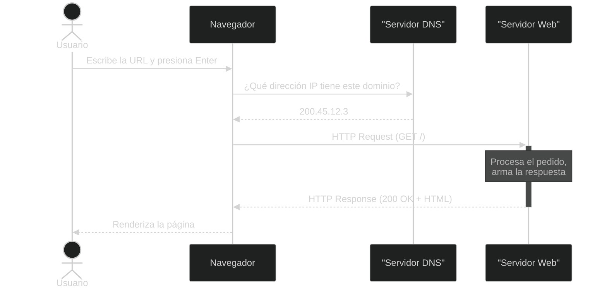

# El ciclo completo de un pedido
Desde el Enter hasta el HTML renderizado

```mermaid
%%{init: {"theme":"dark","themeVariables":{"fontFamily":"Inter","fontSize":"16px"}} }%%
sequenceDiagram
    actor Usuario
    participant Navegador
    participant DNS as "Servidor DNS"
    participant Servidor as "Servidor Web"

    Usuario->>Navegador: Escribe la URL y presiona Enter
    Navegador->>DNS: ¿Qué dirección IP tiene este dominio?
    DNS-->>Navegador: 200.45.12.3
    Navegador->>+Servidor: HTTP Request (GET /)
    Note over Servidor: Procesa el pedido,<br/>arma la respuesta
    Servidor-->>-Navegador: HTTP Response (200 OK + HTML)
    Navegador-->>Usuario: Renderiza la página
```

La resolución de nombres (DNS) ocurre una sola vez por dominio; el ciclo pedido-respuesta se repite en cada interacción.

