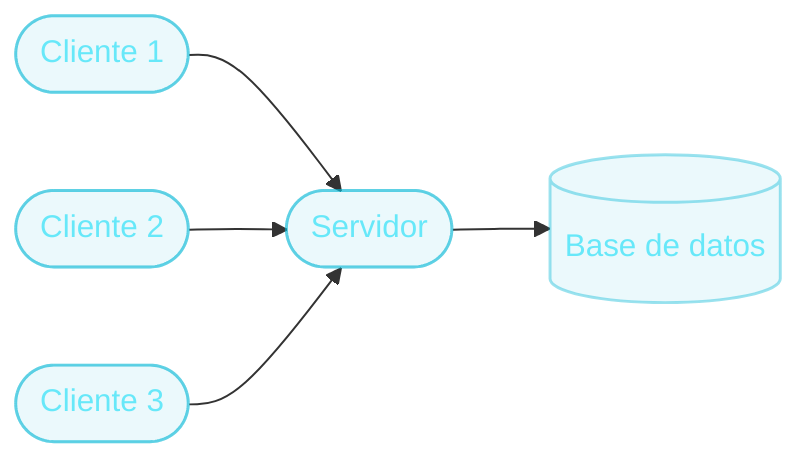

# Arquitectura Cliente-Servidor
Dos roles, una conversación

- **Cliente:** inicia la comunicación. Pide algo y espera una respuesta. Ejemplos: el navegador, una app mobile, otro servidor.
- **Servidor:** espera pedidos, los procesa y responde. Ejemplos: una API, una base de datos, un servidor de archivos.

  

  

    
<carbon:document class="text-base" />

    Una regla clave
  

  
El <strong>cliente siempre inicia</strong> la comunicación. El servidor nunca "llama" espontáneamente a un cliente para avisarle algo (sin mecanismos especiales como WebSockets o polling).

::right::

  

  
Un servidor, muchos clientes

El servidor comparte procesador, memoria y conexiones entre todos los clientes que lo usan al mismo tiempo.

