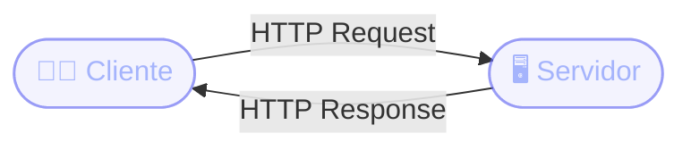

# Aplicaciones Web y HTTP
Cliente, servidor y el protocolo que los conecta

Antes de escribir la primera línea de un controller, necesitamos entender **cómo viaja un pedido** desde el navegador hasta el servidor y de vuelta.

  
Docente <strong class="text-slate-300">Ezequiel Sosa</strong>

  
Clase <strong class="text-slate-300">Aplicaciones Web — Parte 1: Teoría</strong>

::right::

  

  
Pedido y Respuesta

