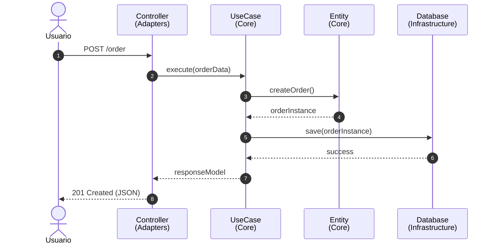

# Flujo de Ejecución: Un caso puntual
Crear un nuevo pedido (Create Order)

El flujo demuestra cómo los datos atraviesan los límites de las capas utilizando **puertos** (interfaces) para evitar acoplamiento directo:

  

    1
    

      El **Controller (UI)** recibe el request HTTP POST, valida el formato JSON y crea un Request Model (DTO).
    

  

  

    2
    

      Llama al Caso de Uso a través del puerto de entrada **(Input Boundary)** de forma agnóstica.
    

  

  

    3
    

      El **Use Case (Interactor)** aplica la lógica, interactúa con la **Entidad (Entity)** y decide guardar.
    

  

  

    4
    

      Invoca al puerto de salida **(Output Boundary / Gateway)** para guardar, el cual está implementado en la Capa DB.
    

  

::right::

  

  
Diagrama de Secuencia

