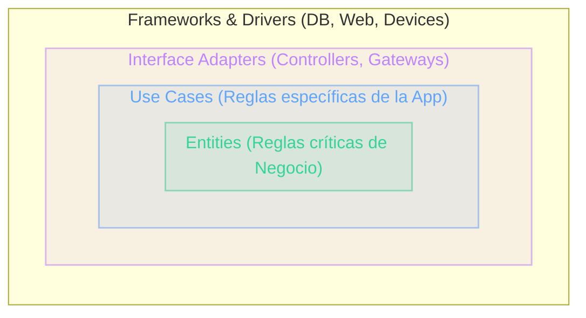

# Filosofía de Clean Architecture
Independencia y Flexibilidad

<!-- Regla de dependencia -->

  

  

    
<carbon:security class="text-base" />

    La Regla de Dependencia (Dependency Rule)
  

  

    Las dependencias de código <strong>solo pueden apuntar hacia adentro</strong>. 
    El código de una capa interna no debe saber absolutamente nada sobre las clases, variables o funciones declaradas en las capas externas.
  

<!-- Los 5 pilares -->

  

  

    
<carbon:checkmark class="text-base" />

    Los 5 Pilares de Independencia
  

  <ul class="text-[11px] text-slate-400 leading-snug space-y-1 list-disc pl-4">
    <li><strong>De Frameworks:</strong> Las librerías son herramientas, no el núcleo.</li>
    <li><strong>De la UI:</strong> La interfaz gráfica puede cambiar sin tocar el negocio.</li>
    <li><strong>De la Base de Datos:</strong> El motor de persistencia es un detalle.</li>
    <li><strong>De Agentes Externos:</strong> Las reglas de negocio no conocen el exterior.</li>
    <li><strong>Altamente Testeable:</strong> El núcleo se testea sin simular UI o BD pesadas.</li>
  </ul>

::right::

  

  
Visualización de Dependencias

