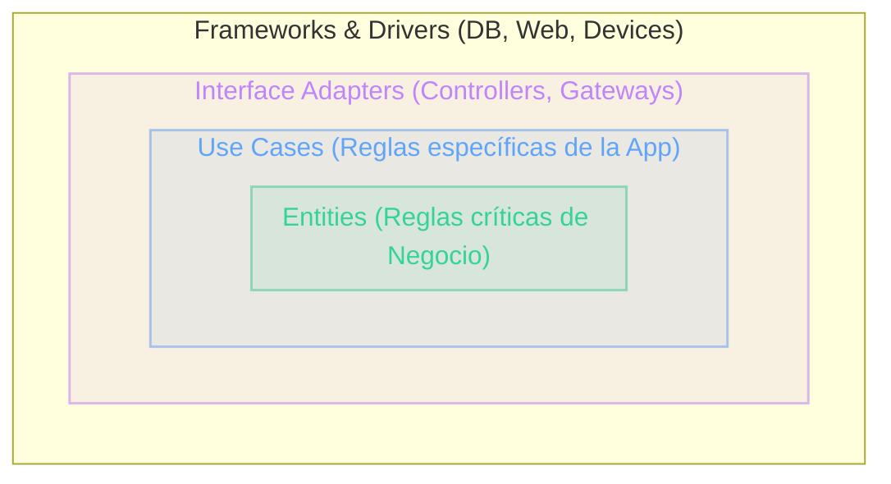

# Clean Architecture
Principios, Capas y Comparativa con Fowler

Propuesta por Robert C. Martin ("Uncle Bob"), es una evolución en el diseño de software enfocada en la mantenibilidad, desacoplamiento y testeabilidad extrema.

  
Docente <strong class="text-slate-300">Ezequiel Sosa</strong>

  
Clase <strong class="text-slate-300">Arquitecturas Limpias</strong>

::right::

  

  
La Regla de Dependencia

