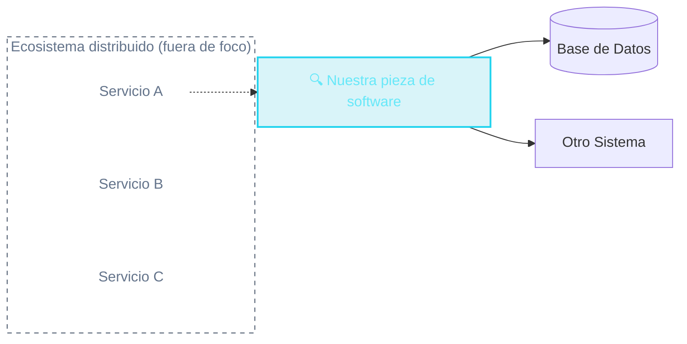

# Arquitectura vs. Diseño de Software
Dos "zooms" distintos sobre el mismo problema — el alcance de esta materia

  <!-- Arquitectura -->
  

    

      

        
        Arquitectura de Software
      

      <ul class="text-[11px] text-slate-400 space-y-1.5 list-disc pl-4">
        <li>Cómo se organizan <strong>múltiples</strong> sistemas y servicios distribuidos.</li>
        <li>Comunicación entre nodos, colas, balanceo de carga, escalabilidad horizontal.</li>
        <li><strong>Fuera del alcance</strong> de esta materia.</li>
      </ul>
    

  

  <!-- Diseño -->
  

    

      

        
        Diseño de Software Esta materia
      

      <ul class="text-[11px] text-slate-400 space-y-1.5 list-disc pl-4">
        <li>Zoom sobre <strong>una sola pieza</strong> de software: sus clases, módulos y capas internas.</li>
        <li>Algunas interacciones puntuales hacia afuera: otro sistema, la base de datos.</li>
        <li>Cómo organizar el código para que sea mantenible y testeable.</li>
      </ul>
    

  

