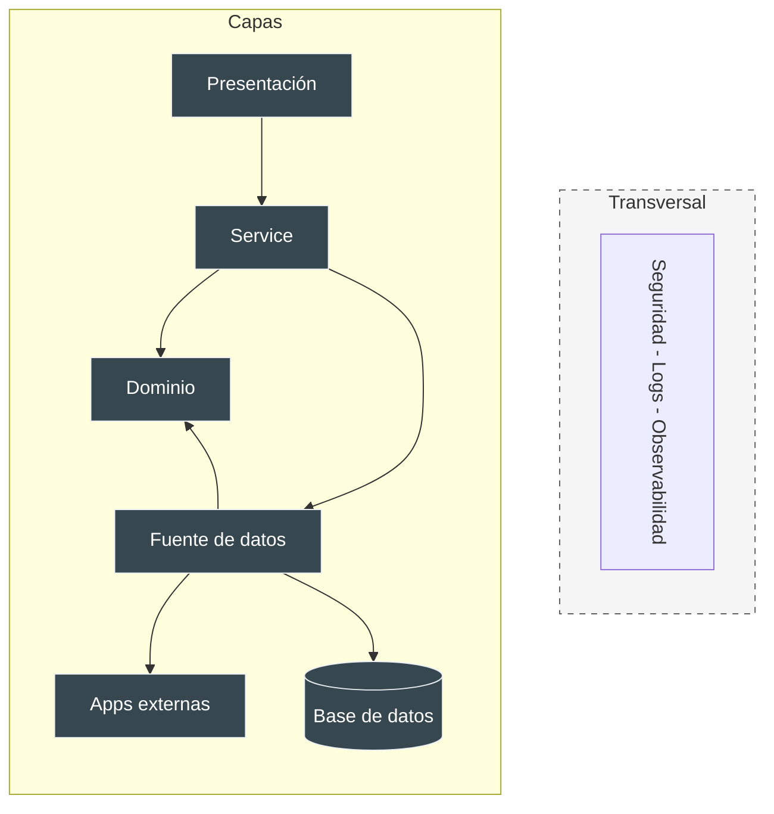

# Layering - Capas
Patrones de Arquitectura

Martin Fowler propone separar el diseño y desarrollo de las *Enterprise Applications* en capas:

  

    1
    

      <strong>Responsabilidades Definidas:</strong> Cada capa describe tareas específicas. Una clase no debe resolver las de otra.
    

  

  

    2
    

      <strong>Coherencia y Roles Únicos:</strong> Cada capa constituye un todo coherente con roles bien definidos y únicos.
    

  

  

    3
    

      <strong>Dependencias Establecidas:</strong> Las capas superiores consumen de las inferiores sin saltear niveles.
    

  

  

    4
    

      <strong>Aspectos Transversales:</strong> Atributos de calidad y requerimientos comunes (seguridad, logs, etc.).
    

  

::right::

Arquitectura en Capas

  Dividir en capas es una de las técnicas más comunes para resolver problemas complejos.
   
  <a href="https://martinfowler.com/bliki/PresentationDomainDataLayering.html" target="_blank" class="text-indigo-400 hover:underline inline-flex items-center gap-1 mt-1 font-semibold">
    Artículo original de Fowler <carbon:arrow-up-right class="text-[8px]" />
  </a>

<!--
Presenter Notes:
- Dividir en capas (layering) es una de las técnicas más comunes para resolver un problema de diseño complejo.
- El estilo arquitectónico no implica que tenga que desarrollar la aplicación en este orden. El desarrollo va a ser interactivo cross-layer. Pero lo que tiene de bueno este estilo es la facilidad de volver a hacer foco en la problemática de cada capa.
- Generalmente primero necesito conocer sobre el dominio, luego una aproximación de cómo va a ser usado (presentación) y eso va a refinar la forma en que se estructuran los datos y reparten las responsabilidades en el dominio.
-->
