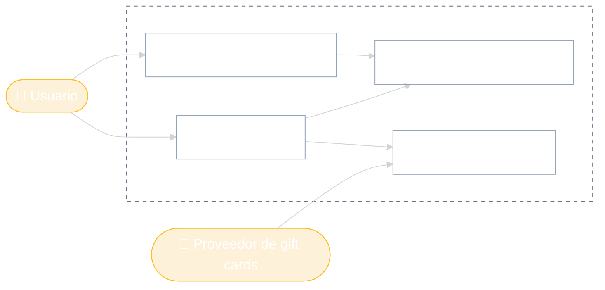
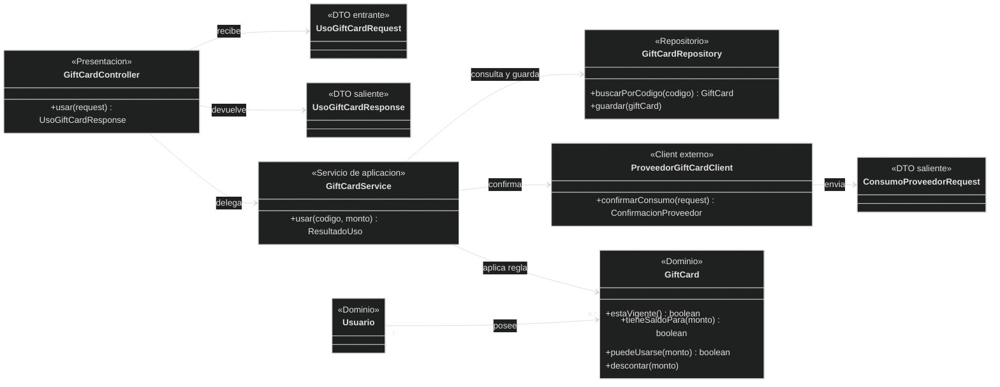
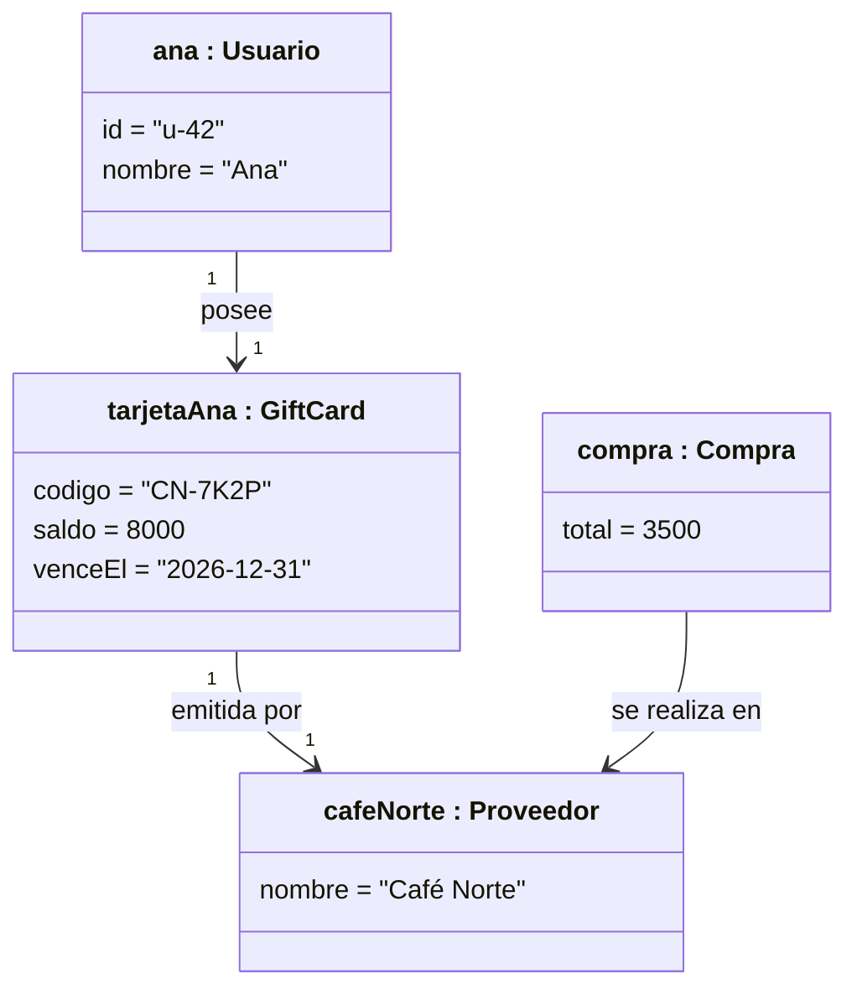
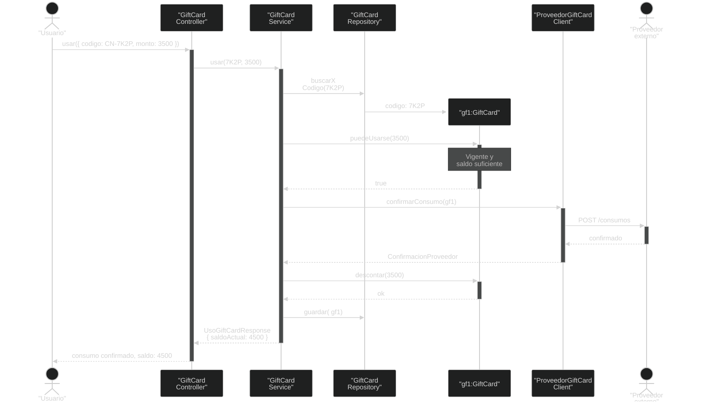

# Ejemplo: Gift Cards
Del requerimiento al diseño

Imaginemos una aplicación que administra gift cards de distintos proveedores. Antes de hablar de clases, acordamos <strong>qué debe poder hacer</strong>.

  
<carbon:checkmark-filled class="text-amber-400" /> Una persona puede consultar sus gift cards y su saldo.

  
<carbon:checkmark-filled class="text-amber-400" /> Puede usar una gift card al pagar una compra.

  
<carbon:checkmark-filled class="text-amber-400" /> El sistema valida la vigencia y el saldo disponible.

  
<carbon:checkmark-filled class="text-amber-400" /> El proveedor externo confirma el consumo.

::right::

Los casos de uso expresan comportamiento observable; todavía no deciden cómo se implementa.

<!--
Presenter Notes:
- El diagrama no pretende ser UML formal: es una conversación sobre actores y objetivos.
- El proveedor también aparece como actor porque participa en la confirmación del consumo.
-->

---

# Un recorte de las capas
Una posible colaboración para usar una gift card

<!--
Presenter Notes:
- Es deliberadamente incompleto: un diagrama de clases es una vista, no el sistema entero.
- El DTO no se convierte en objeto de dominio: transporta datos en el borde.
- El service coordina, pero la regla de saldo y vigencia vive en GiftCard.
-->

---
layout: two-cols
layoutClass: gap-8 items-center
---

# Una foto del dominio
Diagrama de objetos

El diagrama anterior mostraba <strong>tipos</strong>. Ahora vemos objetos reales en un instante: Ana tiene una gift card de Café Norte, vigente y con saldo para cubrir el consumo.

  
Escenario

  
Ana quiere pagar un café de $3.500 con una gift card cuyo saldo es $8.000. La tarjeta vence el 31 de diciembre de 2026.

::right::

Una instancia concreta permite discutir valores y reglas con lenguaje del negocio.

<!--
Presenter Notes:
- Esta es una foto previa al consumo.
- Pregunta para el curso: ¿qué debería pasar si saldo fuera 2000 o si ya hubiera vencido?
-->

---
class: sequence-tight
---

# Usar la gift card
Diagrama de secuencia: consumo de $3.500 con la tarjeta 7K2P

<!--
Presenter Notes:
- La secuencia se puede usar para revisar responsabilidades: ¿quién sabe qué? ¿quién debería cambiar el saldo?
- Si el proveedor rechaza el consumo, no se descuenta ni se guarda: un buen disparador para hablar de errores y consistencia.
-->
