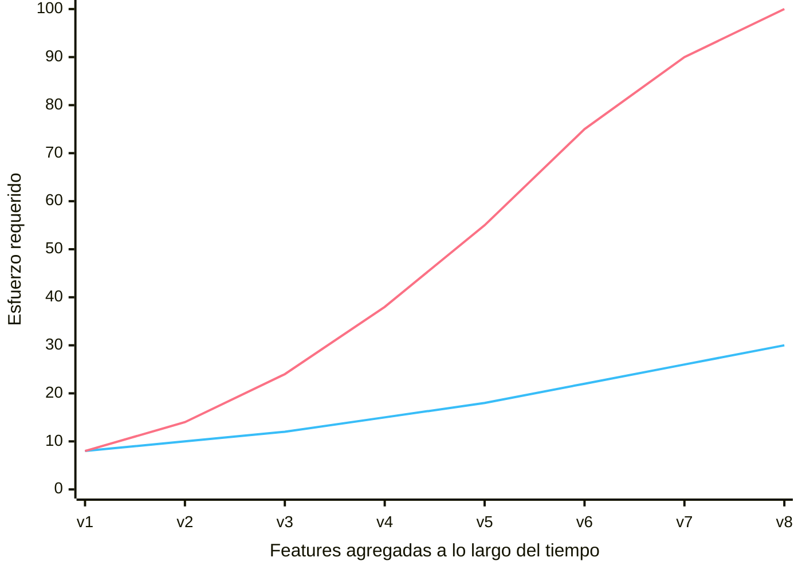

# Nueva Feature vs. Esfuerzo Requerido
La curva del "Big Ball of Mud" — Clean Architecture, Cap. 1

  
 Diseño cuidado

  
 Diseño descuidado ("bola de barro")

  Sin cuidar el diseño, cada nueva feature cuesta más que la anterior: el equipo desacelera hasta casi detenerse — aunque el código siga "funcionando".

