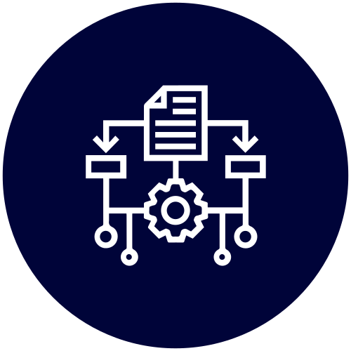

# Diseño de Software

Introducción al desarrollo de aplicaciones

Conceptos de arquitectura, aspectos comunes de las aplicaciones y estructuración en capas (layering).

  
Docente <strong class="text-slate-300">Ezequiel Sosa</strong>

  
JTP <strong class="text-slate-300">Nicolas Contreras</strong>

  
Ayudante <strong class="text-slate-300">Santino Carrizo</strong>

::right::

  

  

