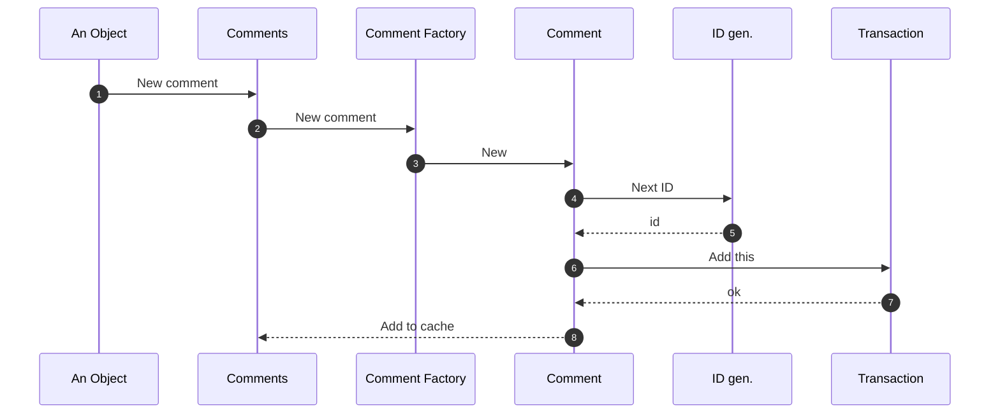

# Usuarios Concurrentes / Transacciones
Un mismo Caso de Uso, ejecutado muchas veces a la vez

  
Cada ejecución del CU tiene:

  <ul class="text-[11px] text-slate-400 leading-snug space-y-1 list-disc pl-4">
    <li><strong>Datos generales:</strong> compartidos, ej. la Factory.</li>
    <li><strong>Datos propios:</strong> por ejecución, ej. el comentario.</li>
    <li><strong>Distintos puntos de ejecución</strong> en simultáneo.</li>
  </ul>

  

    
1 usuario

    
5 usuarios concurrentes

  

  
→

  
UC1

::right::

  

  
Secuencia: nuevo comentario

