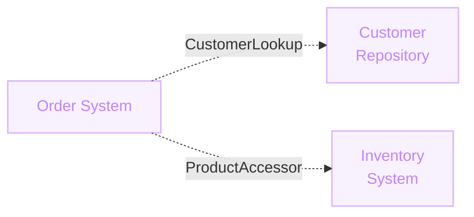
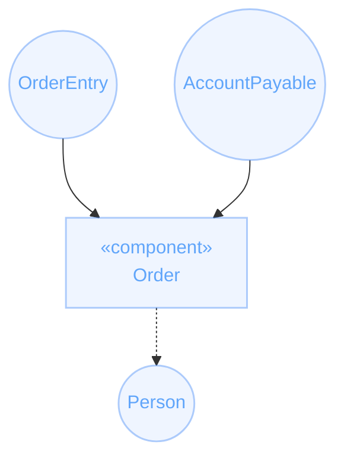

# Diagrama de Componentes
Piezas de software y sus interfaces

  
Formas de consumir un componente

  <ul class="text-[11px] text-slate-400 leading-snug space-y-1.5 list-disc pl-4">
    <li><strong>Librerías:</strong> mismo ambiente / se compila junto.</li>
    <li><strong>Servicios:</strong> consumo "remoto" — API, DB, ...</li>
    <li><strong>Apps con UI:</strong> interacción directa del usuario.</li>
  </ul>

::right::

  

  
Puertos de un componente

