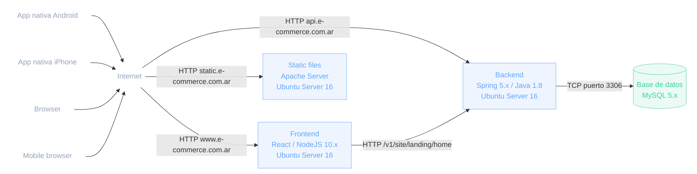

# UML - Diagrama de Despliegue
Configuración de nodos en tiempo de ejecución y sus artefactos

Muestra la configuración de los nodos de procesamiento en tiempo de ejecución y los artefactos que residen en ellos. Cubren la vista de despliegue estática de una arquitectura. Ejemplo de alcance general de una arquitectura cliente-servidor.

  

