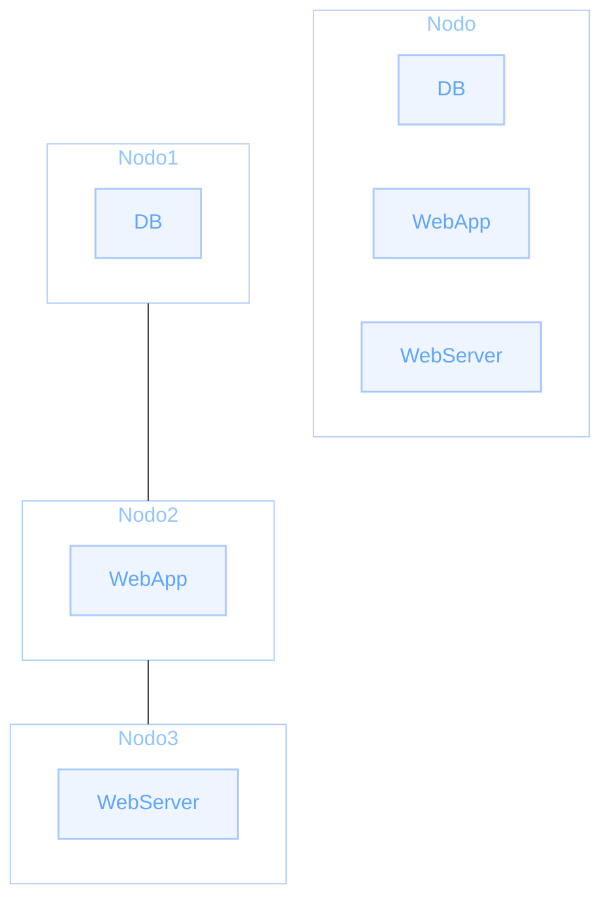
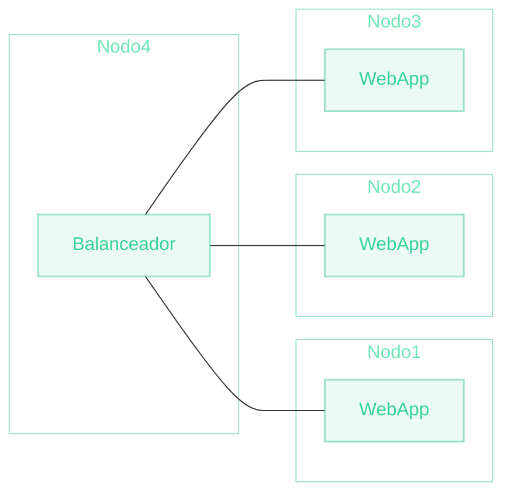

# Distribución
Mismos componentes, distintas topologías

  
Todo junto vs. separado por nodo

```mermaid
graph TD
  subgraph Nodo["Nodo"]
    direction LR
    DB1["DB"]
    WA1["WebApp"]
    WS1["WebServer"]
  end
  subgraph N1["Nodo1"]
    DB2["DB"]
  end
  subgraph N2["Nodo2"]
    WA2["WebApp"]
  end
  subgraph N3["Nodo3"]
    WS2["WebServer"]
  end
  N1 --- N2 --- N3

  style Nodo fill:transparent,stroke:#3b82f666,stroke-width:1px,color:#93c5fd
  style N1 fill:transparent,stroke:#3b82f666,stroke-width:1px,color:#93c5fd
  style N2 fill:transparent,stroke:#3b82f666,stroke-width:1px,color:#93c5fd
  style N3 fill:transparent,stroke:#3b82f666,stroke-width:1px,color:#93c5fd
  classDef default fill:#3b82f614,stroke:#3b82f666,stroke-width:1.5px,color:#60a5fa;
```

::right::

  
Balanceo de carga

```mermaid
graph LR
  subgraph N4["Nodo4"]
    Bal["Balanceador"]
  end
  subgraph N1["Nodo1"]
    W1["WebApp"]
  end
  subgraph N2["Nodo2"]
    W2["WebApp"]
  end
  subgraph N3["Nodo3"]
    W3["WebApp"]
  end
  Bal --- W1
  Bal --- W2
  Bal --- W3

  style N4 fill:transparent,stroke:#10b98166,stroke-width:1px,color:#6ee7b7
  style N1 fill:transparent,stroke:#10b98166,stroke-width:1px,color:#6ee7b7
  style N2 fill:transparent,stroke:#10b98166,stroke-width:1px,color:#6ee7b7
  style N3 fill:transparent,stroke:#10b98166,stroke-width:1px,color:#6ee7b7
  classDef default fill:#10b98114,stroke:#10b98166,stroke-width:1.5px,color:#34d399;
```

