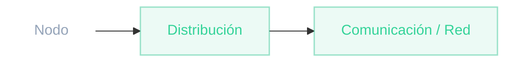
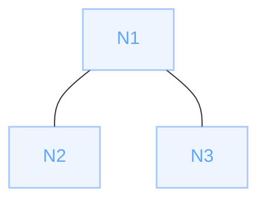

# ¿Qué hago cuando llego al límite de recursos en un nodo?
De un nodo a una red de nodos

```mermaid
graph LR
  N["Nodo"] --> Dist["Distribución"] --> Com["Comunicación / Red"]

  classDef default fill:transparent,stroke:#ffffff14,stroke-width:1px,color:#94a3b8;
  classDef foco fill:#10b98114,stroke:#10b98166,stroke-width:1.5px,color:#34d399;

  class Dist,Com foco;
```

  
Nota al pie

  
No es la única razón para distribuir o tener una red.

::right::

  

  
Red de nodos

```mermaid
graph TD
  N1["N1"] --- N2["N2"]
  N1 --- N3["N3"]

  classDef default fill:#3b82f614,stroke:#3b82f666,stroke-width:1.5px,color:#60a5fa;
```

