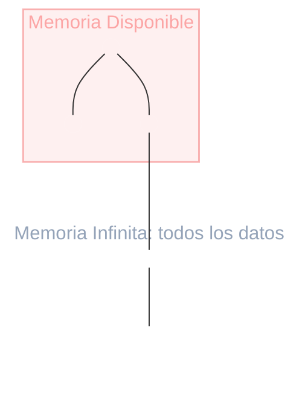

# Consecuencias de que Mem &lt;&lt;&lt; Datos
El mundo feliz de objetos no entra completo en memoria

  

    
<carbon:warning class="text-base" />

    La memoria es un recurso a administrar
  

  <ul class="text-[11px] text-slate-400 leading-snug space-y-1 list-disc pl-4 mt-1">
    <li>Hay que definir <strong>prioridades</strong>: qué objetos viven en memoria y cuáles no.</li>
    <li>Solo puedo operar sobre una <strong>parte limitada</strong> de los datos a la vez.</li>
  </ul>

::right::

  

  
Memoria Disponible vs. Memoria Infinita

Solo la porción marcada cabe en memoria; el resto del grafo de objetos queda afuera.

