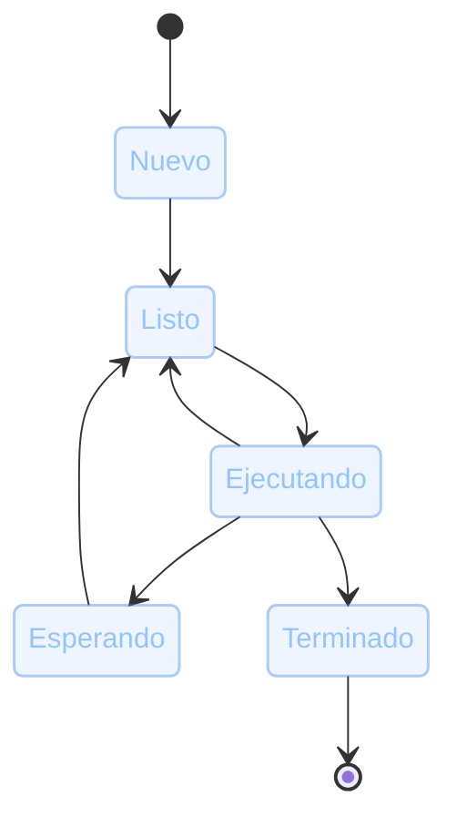

# Procesos
La unidad de asignación de recursos de un SO

Un <strong>proceso</strong> es una instancia de un programa en ejecución. El sistema operativo le asigna sus propios recursos (memoria, CPU, archivos abiertos) y lo aísla del resto.

  

    
<carbon:id-management class="text-base" />

    PCB (Process Control Block)
  

  
Estructura interna que el SO mantiene <strong>por cada proceso</strong> para poder administrarlo: identificador (PID), estado actual, registros de CPU, punteros a su memoria y sus archivos abiertos.

  

    
<carbon:calculator class="text-base" />

    Ejemplo
  

  
Las 2 calculadoras de la slide anterior son <strong>2 procesos distintos</strong>: mismo código, pero cada uno con su propio PCB, su propia memoria y su propio estado.

::right::

  

  
Estados de un proceso

El planificador del SO decide, entre los procesos <strong>Listos</strong>, cuál pasa a <strong>Ejecutando</strong> en cada momento.

