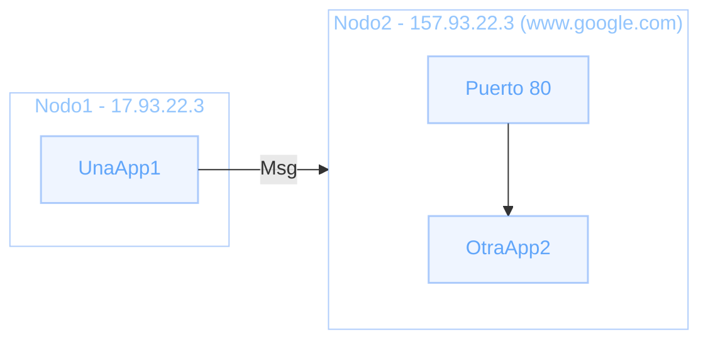

# Red - TCP/IP
Direcciones, puertos y el mensaje que viaja entre nodos

  

```mermaid
graph LR
  subgraph N1["Nodo1 - 17.93.22.3"]
    App1["UnaApp1"]
  end
  subgraph N2["Nodo2 - 157.93.22.3 (www.google.com)"]
    Puerto["Puerto 80"] --> App2["OtraApp2"]
  end

  App1 -->|"Msg"| N2

  style N1 fill:transparent,stroke:#3b82f666,stroke-width:1px,color:#93c5fd
  style N2 fill:transparent,stroke:#3b82f666,stroke-width:1px,color:#93c5fd
  classDef default fill:#3b82f614,stroke:#3b82f666,stroke-width:1.5px,color:#60a5fa;
```

  

    
Tramo 1

    
Tramo 2

  

