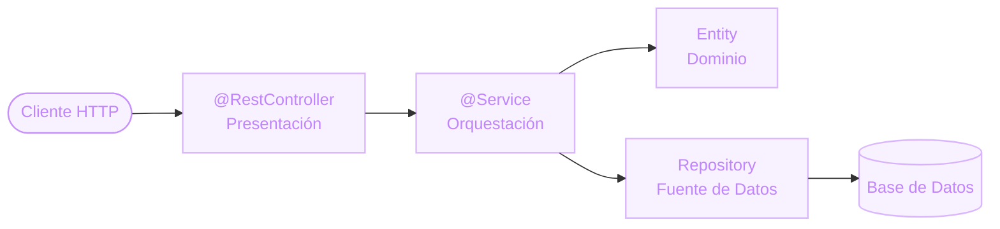

# Las capas, ahora con anotaciones
Controller, Service, Entity y Repository

Las mismas capas de Presentación / Service / Dominio / Fuente de Datos que ya vimos, con su nombre y anotación en Spring:

- **`@RestController`** → recibe el pedido HTTP (Presentación).
- **`@Service`** → orquesta el caso de uso.
- **Entity (`@Entity`)** → el modelo de Dominio, mapeado a una tabla.
- **`Repository`** → la Fuente de Datos, habla con la base.

  

  

    
<carbon:rule class="text-base" />

    Nada nuevo conceptualmente
  

  
Spring no inventa una arquitectura nueva: le pone anotaciones y auto-configuración a las capas que ya conocemos.

::right::

  

  
Del pedido a la base

