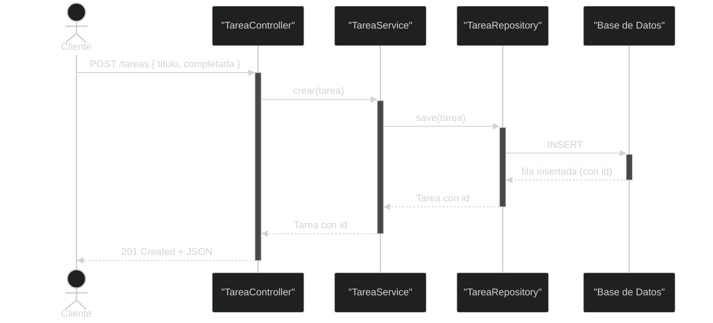

# El flujo completo: crear una tarea
POST /tareas de punta a punta

```mermaid
%%{init: {"theme":"dark","themeVariables":{"fontFamily":"Inter","fontSize":"16px"}} }%%
sequenceDiagram
    actor Cliente
    participant Controller as "TareaController"
    participant Service as "TareaService"
    participant Repo as "TareaRepository"
    participant DB as "Base de Datos"

    Cliente->>+Controller: POST /tareas { titulo, completada }
    Controller->>+Service: crear(tarea)
    Service->>+Repo: save(tarea)
    Repo->>+DB: INSERT
    DB-->>-Repo: fila insertada (con id)
    Repo-->>-Service: Tarea con id
    Service-->>-Controller: Tarea con id
    Controller-->>-Cliente: 201 Created + JSON
```

Cada capa habla solo con la siguiente: el Controller no conoce el Repository, ni el Repository conoce HTTP.

