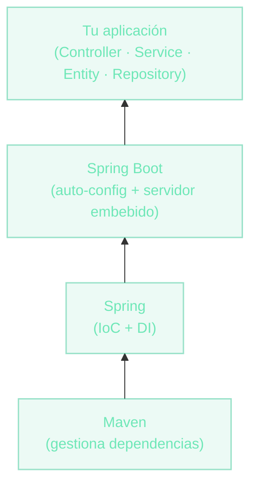

# De Maven a Spring Boot
Construyendo una aplicación web real

Con la teoría de cliente-servidor y HTTP resuelta, ahora vamos a **escribir código**: un proyecto Maven, un mini framework Spring Boot y un endpoint que responde de verdad.

  
Docente <strong class="text-slate-300">Ezequiel Sosa</strong>

  
Clase <strong class="text-slate-300">Aplicaciones Web — Parte 2: Implementación</strong>

::right::

  

  
De abajo hacia arriba

