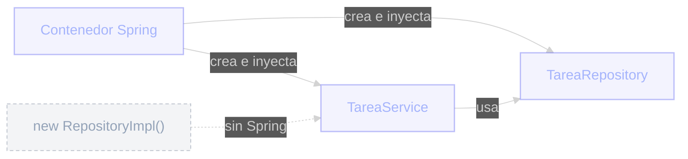

# Una mini introducción a Spring
Un contenedor que arma objetos por vos

Spring es un framework cuyo núcleo es un contenedor de **Inversión de Control (IoC)**: en lugar de que tus clases creen sus propias dependencias con `new`, se las declarás y Spring te las **inyecta**.

- Marcás una clase como componente gestionado por Spring (ej. `@Service`, `@Repository`).
- Pedís lo que necesitás en el constructor.
- Spring resuelve el grafo de dependencias y te entrega instancias listas para usar.

  

  

    
<carbon:connect class="text-base" />

    Inyección de dependencias (DI)
  

  
Es la técnica; IoC es el principio detrás. Menos acoplamiento, clases más fáciles de testear.

::right::

  

  
Quién arma las dependencias

