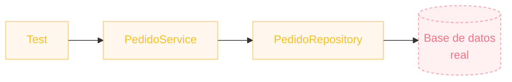

# ¿Y si mi unidad depende de otra?
El problema que Calculadora no tenía

`Calculadora` no dependía de nada más: fácil de testear. Pero un `PedidoService` real suele depender de un `PedidoRepository` que habla con una base de datos.

Testearlo "de verdad" significa:

- Levantar una base de datos para cada corrida de tests.
- Tests **lentos** (segundos en vez de milisegundos).
- Tests **frágiles**: fallan por la red, por datos sucios, no por bugs reales.
- Ya no estás probando <em>una</em> unidad, sino todo el sistema.

  

  

    
<carbon:idea class="text-base" />

    La idea clave
  

  
Para un test <strong>unitario</strong>, no queremos la base de datos real: queremos algo que se comporte como ella, pero que nosotros controlemos.

::right::

  

  
Lo que queremos evitar

