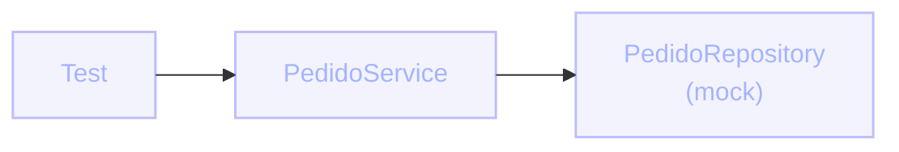

# ¿Qué es un mock?
Un doble de prueba que vos controlás

Un **mock** es un objeto falso que **simula** el comportamiento de una dependencia real (un repositorio, un cliente HTTP, un servicio externo), pero que:

- Vos programás: "cuando te llamen así, respondé esto".
- No accede a la red, ni a disco, ni a una base de datos.
- Permite **verificar** con qué argumentos fue llamado.

  

  

    
<carbon:tree-view class="text-base" />

    Mock es solo uno de los "test doubles"
  

  
Existen otros dobles de prueba (stub, fake, spy, dummy). En esta clase nos enfocamos en <strong>mocks</strong>, los más usados en el día a día con Mockito.

::right::

  

  
Reemplazando la dependencia real

El <strong>Service</strong> es la unidad bajo test. El <strong>Repository</strong> se reemplaza por un mock: rápido, determinista, sin infraestructura.

