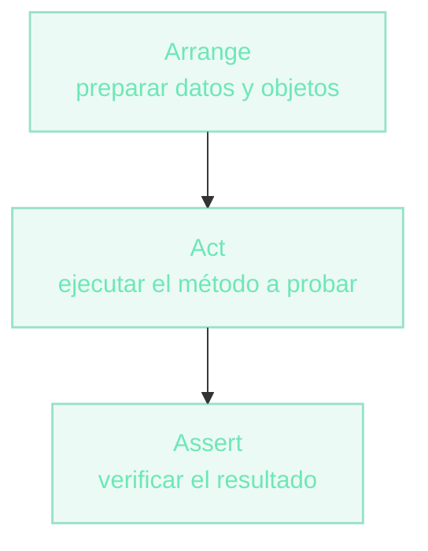

# ¿Qué es un test unitario?
Verificar código con código

Un **test unitario** es código que ejecuta una unidad pequeña de tu programa (un método, una clase) de forma **aislada** y verifica automáticamente que su resultado sea el esperado.

- **Automático:** se ejecuta sin intervención humana.
- **Rápido:** corre en milisegundos, se puede repetir miles de veces.
- **Repetible:** el mismo test da siempre el mismo resultado.
- **Aislado:** prueba una unidad, no el sistema entero.

  

  

    
<carbon:idea class="text-base" />

    ¿Para qué sirve?
  

  
Detecta regresiones apenas aparecen, documenta el comportamiento esperado y habilita refactorizar con confianza.

::right::

  

  
El patrón AAA

Casi todo test unitario tiene esta forma, aunque no esté escrita explícitamente en el código.

