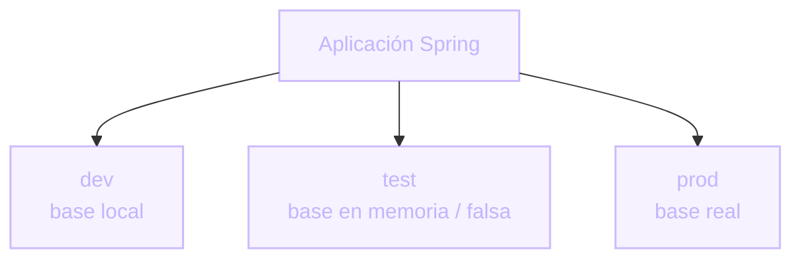

# Profiles de Spring
Configuración distinta según el entorno

Hasta ahora vimos cómo testear **una unidad** con mocks. Pero a veces querés levantar la aplicación completa para testear, sin tocar la infraestructura real (base de datos, servicios externos).

Un **profile** es una etiqueta que le dice a Spring: "activá esta configuración y estos beans, no otros".

- Típicamente: `dev`, `test`, `prod`.
- Cada profile puede tener su propia configuración y sus propios beans.
- En testing local, el profile `test` puede reemplazar la base real por una **en memoria** o por un **cliente falso**.

  

  

    
<carbon:idea class="text-base" />

    Dos estrategias, mismo objetivo
  

  
Base de datos en memoria (ej. H2) para tests de persistencia reales pero rápidos, o un cliente/repositorio falso en Java cuando ni siquiera querés levantar una base.

::right::

  

  
Un profile activo a la vez, por entorno

